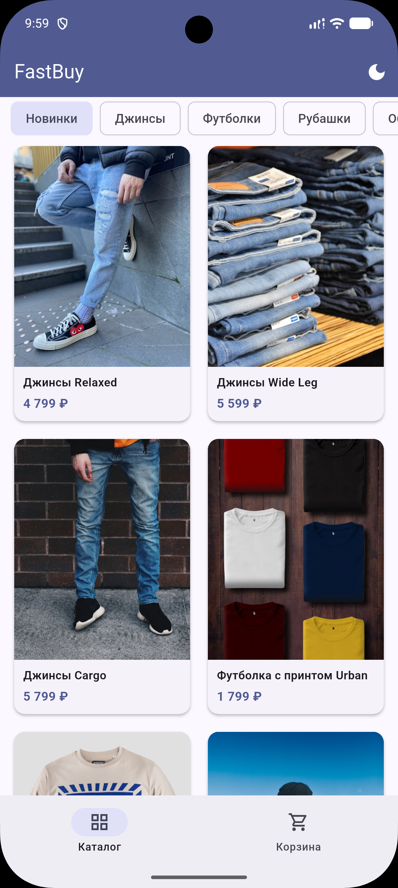
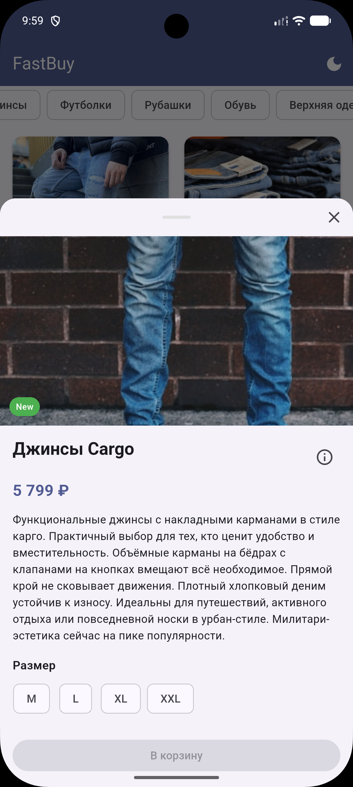
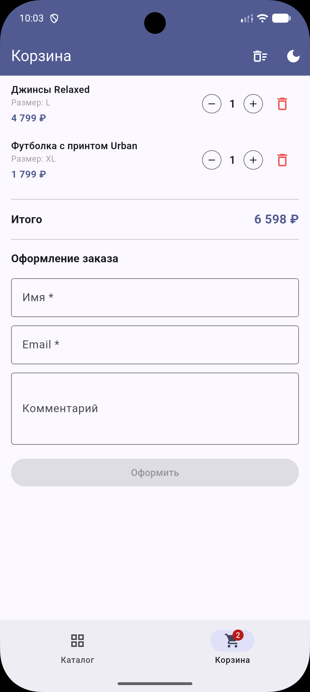
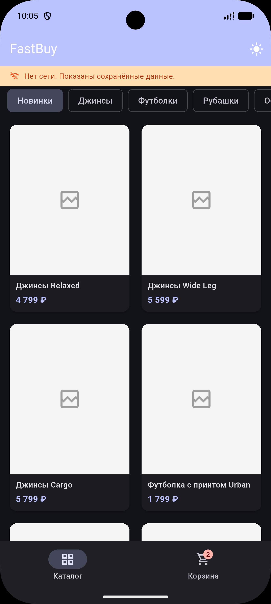

# FastBuy

Мобильный маркетплейс для быстрых покупок. Каталог товаров с фильтрацией по категориям, детальный просмотр карточки, корзина с оформлением заказа и поддержкой тёмной/светлой темы.

## Скриншоты

<table>
  <tr>
    <td align="center"><br/><sub>Каталог</sub></td>
    <td align="center"><br/><sub>Карточка товара</sub></td>
    <td align="center"><br/><sub>Корзина</sub></td>
    <td align="center"><br/><sub>Офлайн-режим</sub></td>
  </tr>
</table>

## Архитектура

```
lib/
├── data/
│   ├── catalog_api.dart        # HTTP-клиент (Bearer-token, timeout 15s)
│   ├── catalog_database.dart   # SQLite кэш каталога (categories + products)
│   ├── cart_database.dart      # SQLite хранилище корзины
│   └── product_repository.dart # Cache-first: кэш → API → обновление UI
│
├── models/
│   ├── product.dart            # Product, ProductSize, fromJson
│   ├── category.dart           # Category
│   └── cart_item.dart          # CartItem, copyWith
│
├── viewmodel/
│   ├── catalog_viewmodel.dart  # Каталог: статус загрузки, фильтрация, офлайн
│   ├── cart_viewmodel.dart     # Корзина: добавление, обновление, подсчёт
│   └── theme_notifier.dart     # Управление темой с сохранением в SharedPreferences
│
├── screens/
│   ├── catalog_screen.dart     # Экран каталога с табами
│   └── cart_screen.dart        # Экран корзины и форма заказа
│
├── widgets/
│   ├── product_card.dart       # Карточка товара в сетке
│   └── product_detail_sheet.dart  # Bottom sheet с деталями и выбором размера
│
└── utils/
    └── price_formatter.dart    # Форматирование цены (рубли + копейки, разряды)
```

**Паттерн:** MVVM + Provider  
**Хранение:** SQLite (`sqflite`) — два файла: `catalog.db` (кэш каталога), `cart.db` (корзина)  
**Сеть:** `http` пакет с Bearer-токеном; `connectivity_plus` для отслеживания смены статуса сети  
**Тема:** `ThemeMode.system` по умолчанию; ручное переключение сохраняется через `SharedPreferences`

## Стек

| Инструмент | Назначение |
|------------|-----------|
| Flutter 3.x / Dart 3.4+ | UI-фреймворк |
| provider ^6.1 | DI и state management |
| sqflite ^2.3 | Локальная SQLite БД |
| http ^1.2 | HTTP-запросы к API |
| connectivity_plus ^6.0 | Мониторинг сети |
| shared_preferences ^2.3 | Хранение настроек |
| flutter_lints ^6.0 | Статический анализ |

## Сборка проекта

Убедитесь, что установлен [Flutter SDK](https://docs.flutter.dev/get-started/install) версии 3.22+.

```bash
# Установить зависимости
flutter pub get

# Запустить приложение
flutter run

# Статический анализ
flutter analyze

# Тесты
flutter test

# Собрать APK (release)
flutter build apk --release

# Собрать APK (debug)
flutter build apk --debug
```

## Команда

| Участник | Роль |
|----------|------|
| Blink    | Разработчик (Flutter) |
